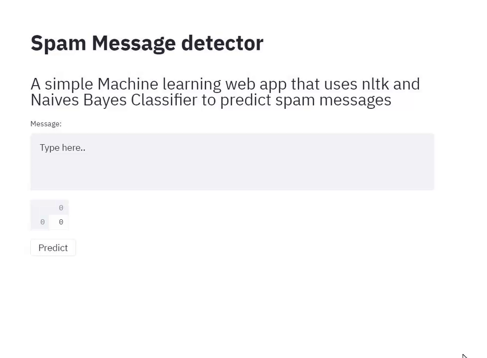

# spam-detector
 Detect spam messages with Naives Bayers Classifier
 
 Dataset was obtained from https://www.kaggle.com/venky73/spam-mails-dataset?select=spam_ham_dataset.csv
 
 Model.py goes through step by step how to use NLTK, preprocess the data and create the machine learning model
 
 App.py uses streamlit to create the spam detector app and run instantly. The app allows you input a message which
 can be detected as either spam or not(ham)
 
 Install streamlit on cmd with pip install streamlit
 Run the app with streamlit run app.py
 
 

